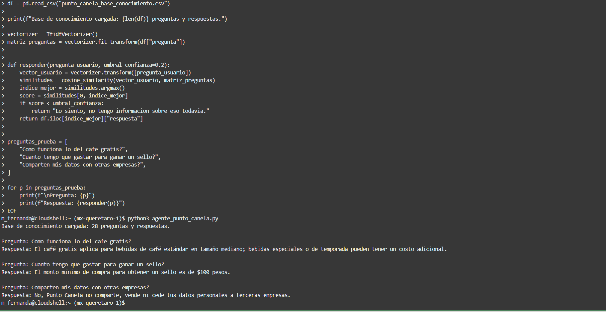

# ☕ Agente Inteligente - Punto Canela

Proyecto desarrollado para el **Challenge Alura Agente**, del programa **ONE AI for Tech** (Oracle + Alura Latam).

## 📋 Descripción general del proyecto

Este proyecto es un **agente inteligente** capaz de responder preguntas en lenguaje natural sobre el **programa de fidelización de Punto Canela**, una cafetería ficticia donde los clientes acumulan sellos escaneando un código QR en cada compra y obtienen un café gratis al completar 5 sellos.

El agente utiliza una base de conocimiento en formato CSV (con preguntas y respuestas frecuentes sobre el programa, política de privacidad y términos y condiciones) para responder de forma automática a las dudas de los clientes.El agente utiliza una base de conocimiento en formato CSV...para responder de forma automática a las dudas de los clientes.
## 🌐 Aplicación web en vivo

Prueba el agente funcionando en línea aquí: **[Agente Punto Canela](https://challenge-alura-agente-punto-canela-agznofb4gu2nqrxsnhzi4s.streamlit.app)**

## 🏗️ Arquitectura de la solución

El proyecto sigue una arquitectura simple de **recuperación de información (retrieval-based)**:

1. **Base de conocimiento (CSV):** contiene pares de pregunta/respuesta sobre el programa de fidelización.
2. **Vectorización (TF-IDF):** las preguntas de la base de conocimiento se convierten en vectores numéricos usando `TfidfVectorizer` de scikit-learn.
3. **Comparación por similitud de coseno:** cuando el usuario hace una pregunta, esta también se convierte en vector y se compara contra todas las preguntas de la base de conocimiento.
4. **Selección de la mejor respuesta:** el agente devuelve la respuesta correspondiente a la pregunta más parecida (mayor similitud). Si ninguna pregunta es lo suficientemente parecida (por debajo de un umbral de confianza), el agente indica que no tiene información sobre ese tema, evitando respuestas inventadas.

**Flujo del proceso:**
1. El usuario hace una pregunta
2. Se vectoriza con TF-IDF
3. Se calcula la similitud de coseno contra la base de conocimiento
4. Si la similitud supera el umbral → se devuelve la respuesta del CSV
5. Si no supera el umbral → se devuelve el mensaje "No tengo información sobre eso todavía"

## 🛠️ Tecnologías y herramientas utilizadas

- **Python 3**
- **pandas** — carga y manejo de la base de conocimiento (CSV)
- **scikit-learn** — vectorización TF-IDF y cálculo de similitud de coseno
- **Google Colab** — entorno de desarrollo y pruebas
- **Oracle Cloud Infrastructure (OCI)** — despliegue y ejecución de la aplicación en la nube (Cloud Shell)

## ▶️ Instrucciones para ejecutar el proyecto

### Opción 1: Google Colab (recomendado)
1. Abre [Google Colab](https://colab.research.google.com/)
2. Sube el archivo `punto_canela_base_conocimiento.csv`
3. Copia y pega el contenido de `agente_punto_canela.py` en una celda
4. Ejecuta la celda con el botón ▶️
5. El agente probará automáticamente algunas preguntas de ejemplo

### Opción 2: Localmente o en OCI Cloud Shell
1. Clona este repositorio:
```bash
   git clone https://github.com/MarSierraS/challenge-alura-agente-punto-canela.git
   cd challenge-alura-agente-punto-canela
```
2. Instala las dependencias:
```bash
   pip install pandas scikit-learn
```
3. Ejecuta el script:
```bash
   python3 agente_punto_canela.py
```

## 💬 Ejemplos de preguntas que el agente puede responder

- ¿Cómo funciona el programa de fidelización de Punto Canela?
- ¿Cuál es el monto mínimo para obtener un sello?
- ¿Cuántos sellos necesito para el café gratis?
- ¿Los sellos caducan?
- ¿Qué datos personales recopila Punto Canela?
- ¿Punto Canela comparte mis datos con terceros?
- ¿El café gratis se puede combinar con otras promociones?

## 📝 Ejemplos de respuestas generadas por el agente

**Pregunta:** ¿Cómo funciona lo del café gratis?
**Respuesta:** El café gratis aplica para bebidas de café estándar en tamaño mediano; bebidas especiales o de temporada pueden tener un costo adicional.

**Pregunta:** ¿Cuánto tengo que gastar para ganar un sello?
**Respuesta:** El monto mínimo de compra para obtener un sello es de $100 pesos.

**Pregunta:** ¿Comparten mis datos con otras empresas?
**Respuesta:** No, Punto Canela no comparte, vende ni cede tus datos personales a terceras empresas.

## ☁️ Despliegue en OCI

El agente fue ejecutado y probado directamente dentro de **Oracle Cloud Infrastructure**, utilizando **OCI Cloud Shell** (terminal en la nube integrada en la consola de OCI), como evidencia de que la solución corre exitosamente en la infraestructura de Oracle Cloud.

**Pasos realizados:**
1. Se creó una cuenta gratuita (Always Free) en OCI.
2. Se accedió a **OCI Cloud Shell** desde la consola.
3. Se subieron los archivos del proyecto (`agente_punto_canela.py` y `punto_canela_base_conocimiento.csv`).
4. Se instalaron las dependencias necesarias (`pandas`, `scikit-learn`).
5. Se ejecutó el agente directamente en el entorno de OCI, obteniendo respuestas correctas a las preguntas de prueba.

**Captura de pantalla (evidencia):**



*La captura muestra el agente cargando la base de conocimiento (28 preguntas y respuestas) y respondiendo correctamente dentro de la sesión de OCI Cloud Shell (región mx-queretaro-1).*

## 📁 Estructura del repositoriochallenge-alura-agente-punto-canela/
├── README.md                              # Este archivo
├── agente_punto_canela.py                 # Código del agente inteligente
├── punto_canela_base_conocimiento.csv     # Base de conocimiento (preguntas y respuestas)
└── evidencia_deploy_oci.png               # Captura del agente corriendo en OCI## 👤 Autora

Proyecto desarrollado como parte del programa **ONE AI for Tech** (Grupo 10) - Oracle & Alura Latam.
